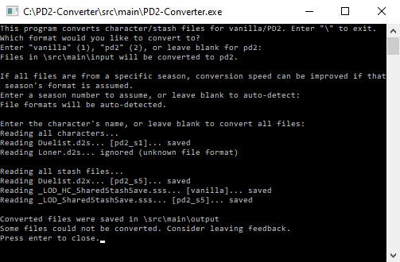

## Simple Character/Stash Converter for PD2
This program converts character/stash files between vanilla and PD2, and updates PD2 files so they can be used with the most recent season without needing to drop old items.

Supports all PD2 characters and vanilla characters from v1.10+ (.d2s files), as well as shared/personal stashes from PlugY v11.02+ (.sss and .d2x files). Built from [dschu012's D2SLib](https://github.com/dschu012/D2SLib) repository. Requires .NET framework to run.

I didn't bother separating the source code from the release code, so there are a bunch of extra folders/files which can be ignored.

### [Download](https://github.com/BetweenWalls/PD2-Converter/archive/main.zip)

### Instructions
1. Download PD2-Converter-main.zip and extract the files
2. Copy your character and stash files from your save folder (Diablo II\Save) and paste them into PD2-Converter-main\src\main\input
3. Run PD2-Converter.exe (it's in PD2-Converter-main\src\main) - a command line menu will pop up
4. Leave the 3 prompts blank by pressing enter 3 times and wait for the program to convert your files
5. Copy the converted files from PD2-Converter-main\src\main\output and paste them into your save folder (Diablo II\Save)

If a converted file doesn't work for whatever reason, a backup of the original file will still be in PD2-Converter-main\src\main\input.

If you want to revert to an older version of PD2 for whatever reason, you can replace your game files with the versions included in the Patches folder.

### Errors
The converter may not work in all cases - if the converter doesn't work for a particular file, you can use the traditional method of reverting to the previous season and dropping whichever items were fundamentally altered after that season. If you drop the altered items, you *won't* need to convert anything. If you want to try keeping those items, transfer them all to a new character instead of dropping them and then use the converter on that new character only.

1. Revert to a previous season
2. Drop any items which were fundamentally altered after that season (or move them to a new character)
3. Update to the most recent season
4. If the items were moved to a new character, use the converter on that character

Fundamentally altered items per season:
* S2: maps, Standard of Heroes
* S3: maps, any item with +X% Enhanced Damage or +X to Maximum Damage per Character Level
* S7: maps (including dungeons & arenas)
* S8: items with +X Open Wounds Damage per Second

The converter may have trouble with:
* Personalized items
* Items with specific corruptions which were removed/changed in later seasons (details unknown)
* Standard of Heroes (S2 or earlier)
* Mephisto's Soulstone (S2 or earlier)

### Reverse Conversions
Although primarily designed for converting vanilla or PD2 characters & stashes to the most recent PD2 season, characters may also be converted in the reverse direction. When converting characters from PD2 to vanilla, items or item affixes that don't exist in vanilla will prevent files with them from being converted. While this "reverse" conversion seems to otherwise work correctly for loading/playing those characters in the vanilla game, other programs (such as Hero Editor) may not load them correctly. To fix this issue when using such programs to edit characters from PD2, the characters should be converted to vanilla and *saved from within the vanilla game* prior to being edited.

### Feedback

If you encounter bugs, let me know on reddit ([u/BetweenWalls](https://www.reddit.com/message/compose/?to=BetweenWalls)) or discord (@BetweenWalls#2390), or just submit an issue here.

